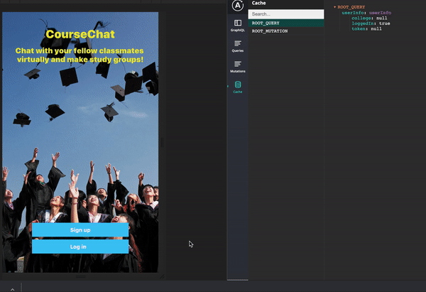

# React-Native-Course-Chat-app
> GraphQL and postgresql/knex. Mobile version of course chat application to allow students to chat with one another.

## Contents
* [Requirements](#Requirements)
* [Features](#Features)
* [Demo](#Demo)
* [How To Use](#How-To-Use)
* [Requirements](#Requirements)

## Requirements

In order to run this application, you must have the node.js, npm, installed and updated to the latest versions.  Then run npm install in root directory and graphql-server directory.

## Features
* Login and authenticate using graphql, receive errors if any.
* Allow user to reload app and stay logged in as long as json web token hasn't expired. 
* Logout and clear token and all user information
* Allow users to add courses and communicate with fellow classmates.

## Demo

## License

Developed in 2020. This application is under the MIT license.
Made by [Akhil Khanna](https://github.com/akhil1213) :snowflake:
